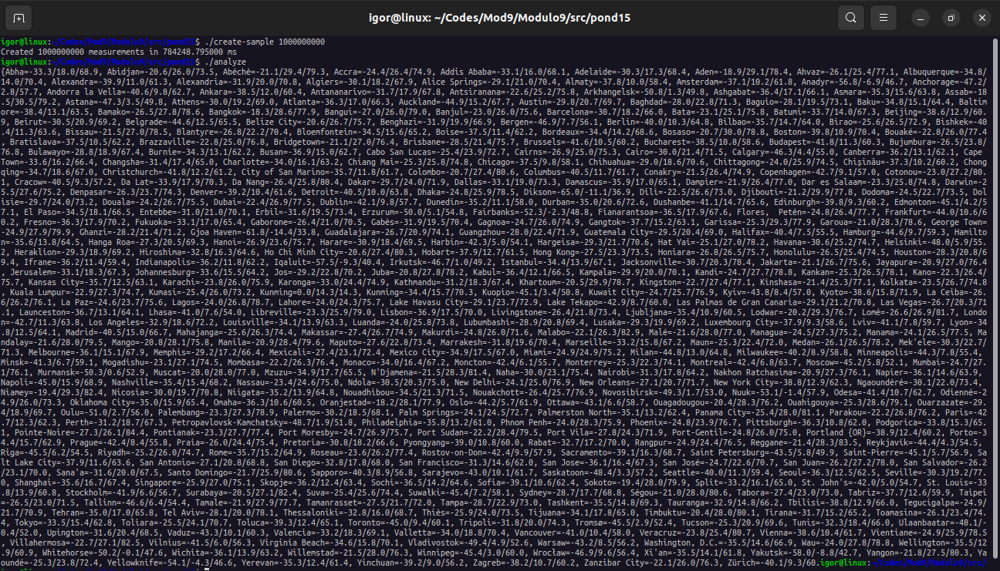
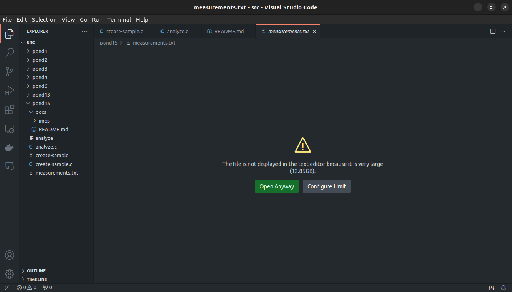

# Projeto de Análise de Dados em Grande Escala

Este projeto consiste em dois programas em C, `create-sample.c` e `analyze.c`, obtidos de um repositório público de [dannyvankooten](https://github.com/dannyvankooten/1brc#submitting), que juntos formam um sistema capaz de processar e analisar grandes conjuntos de dados em paralelo. O objetivo principal é processar um arquivo de dados e gerar estatísticas agregadas para cada grupo identificado no conjunto de dados.

## Componentes do Sistema

### 1. `create-sample.c`

Este programa é responsável por ler um arquivo de dados contendo medidas e gerar estatísticas agregadas para cada grupo identificado. Ele realiza o seguinte processo:

1. **Leitura do Arquivo**: O programa lê um arquivo de texto `measurements.txt` (ou outro especificado como argumento de linha de comando, se fornecido).
2. **Mapeamento em Memória**: Utiliza a função `mmap` para mapear o conteúdo do arquivo na memória.
3. **Processamento Paralelo**: Divide o arquivo em chunks e distribui o processamento entre múltiplas threads utilizando a técnica de programação paralela.
4. **Agregação de Estatísticas**: Calcula estatísticas agregadas (contagem, mínimo, máximo e soma) para cada grupo identificado no arquivo de dados.
5. **Liberação de Recursos**: Libera recursos alocados, como memória mapeada e estruturas de dados.

### 2. `analyze.c`

Este programa recebe os resultados processados pelo `create-sample.c` e realiza as seguintes tarefas:

1. **Leitura dos Resultados**: Lê os resultados processados.
2. **Apresentação dos Resultados**: Apresenta os resultados através do stdout do sistema.
3. **Liberação de Recursos**: Libera recursos alocados, como memória mapeada e estruturas de dados.

## Compilação e Execução

Para compilar o projeto, utilize o compilador GCC com os seguintes comandos:

```bash
gcc -o create-sample create-sample.c -pthread
gcc -o analyze analyze.c -pthread
```

Para executar o projeto, primeiro execute o programa `create-sample` e, em seguida, o programa `analyze`, conforme mostrado abaixo:

```bash
./create-sample 1000000000
./analyze
```

## Notas Adicionais

- O número de threads utilizadas pelo programa pode ser ajustado modificando a macro `NTHREADS`.
- O projeto utiliza técnicas de programação paralela para melhorar o desempenho ao lidar com grandes volumes de dados.
- Certifique-se de que o arquivo de dados a ser processado esteja no formato esperado pelo programa, com os valores separados por ponto e vírgula.

## Visualização do sistema

O programa pode ter seu funcionamento comprovado pelas imagens a seguir





