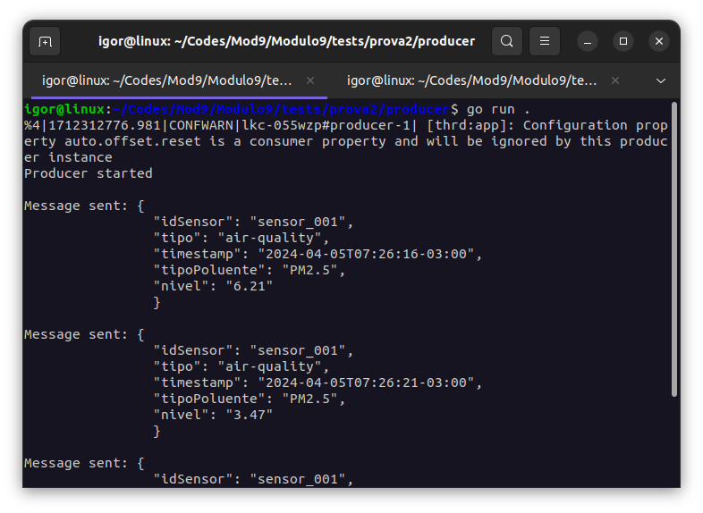
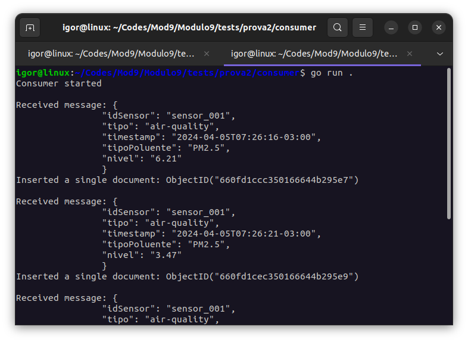
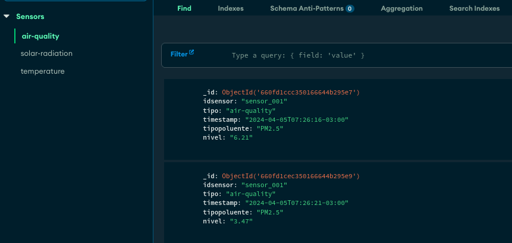

# Produzindo, Consumindo e Armazenando!
Para produzir, consumir e armazenar dados de um simulador de sensor de qualidade do ar basta seguir o tutorial a partir do diretório `prova2`.

### Configuração das variaveis de ambiente
Primeiramente, para acessar o binário do Go, rode o seguinte comando:
```
source .bashrc
```

Em seguida, crie um arquivo `.env` na pasta `/config` com as suas credenciais:
```
BOOTSTRAP_SERVERS = "pkc-ldjyd.southamerica-east1.gcp.confluent.cloud:9092"
CLUSTER_ID = "lkc-055wzp"
CLUSTER_NAME = "Cluster0"
API_KEY = "<sua-chave-api-aqui>"
API_SECRET = "<seu-segredo-api-aqui>"

MONGODB = "<sua-connection-string-aqui>"
```

### Produzindo e Consumindo no Kafka
Para o envio e recebimento de dados, rode o seguinte comando nos diretórios `/producer` e `/consumer`:
```
go run .
```

## IotsimMongoKafka em Ação!
Você pode conferir as imagens do funcionamento a seguir:





